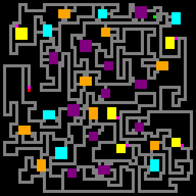

# DungeonSprawler
A tool for generating 2d dungeons;

This is a rust implementation of [Bob Nystrom's dungeon generator dictated in his blog post](https://journal.stuffwithstuff.com/2014/12/21/rooms-and-mazes/) with some modifications inteded to be used for map geration for [Arduboy](https://www.arduboy.com/) games.

An example of a 64x64 sparse dungeon floor



## Useage

Run with:
`./dungeonsprawler example.json`

This tool consumes a json specification that dictates the kind of maps you want to generate.  For example, the following spec will generate a 2 floor dungeon, where each floor is 8x16 tiles.

```
{
    "dungeons": [
      {
        "name": "test_dungeon",
        "height": 16,
        "width": 8,
        "room_types": [],  -- Unimplemented 
        "extra_room_types": 0  -- Unimplemented 
        "amount_of_rooms": 2,
        "room_size_low": 1,
        "room_size_high": 3,
        "start_finish_min_distance": 5,
        "room_padding_density": 3,
        "sparse": false,
        "count": 2
      }
    ],
    "file_path": "dist/",
    "output_format": "fx",
    "include_images": true
}
```


A breakdown of the spec is as follows:
| Field                     | Desc          |
|---------------------------|----------------|
| name                      | Name of the dungeon |
| height                    | map heigh            |
| width                     | map width            |
| room_types                | Unimplemented            |
|extra_room_types |  Unimplemented |
| amount_of_rooms           | maximum amount of non start/end rooms              |
| room_size_low             | smallest dim             |
| room_size_high            | largest dim              |
| start_finish_min_distance | min distance required between end points              |
| room_padding_density      | min distance between rooms             |
| sparse                    | toggle dead end paths          |
| count                     | number of floors / maps with thie spex              |
| file_path                 | output folder for generation      |
| output_format             | output format          |
| include_images            | toggle for png representations of map           |


Note, the room_size_low and room_size_high values dictate a range used for random map size generation.

`Dungeons` is a list, so you can specify all of your dungeons in a single spec for generation.


### Supported output formats:
- "fx"
    - This will output a .txt for each dungeon spec that contains the maps as uint8_t arrays, and a uint24_t array of pointers to each floor for easy indexing

    - The tile numbers map to the following types from generation:
    ```
        Empty => 0
        Wall => 1
        Hall => 2
        Start => 3
        End => 4
        Boss => 5
        Shop => 6
        Treasure => 7
        Secret => 8
        LockedDoor => 9
    ```

### Generation details:

Currently a special tile is placed at the connector for treasure rooms and the floor exit.


### Planned Feature:
 - "Raycast" format
    -  The raycast lib dictates a different numbering for tiles that is current not supported

- Room type spec constraints
    -  currently you can't control what type of rooms.  I intend to let that be configurable in the spec.
    -  Also add an option to include a setting to allow extra types of rooms that the user can define in their game.  0-9 are reserved, so 10-255 can be used to extend the generation.